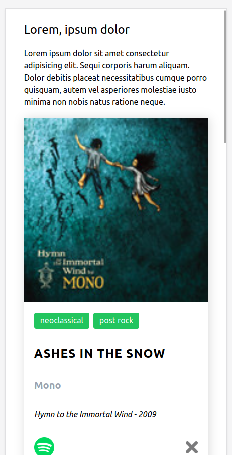
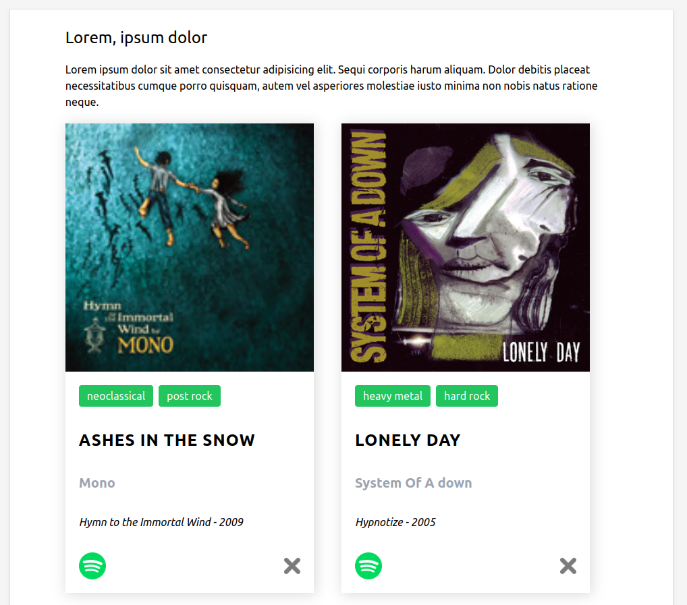

# collection
Becode exercise 15 : create a collection of items to train with the DOM

## Briefing
Create an array containing a collection of objects (films, books, songs), and insert the data of this array dynamically into html with JavaScript. Use tailwind if you want.

[Instructions](https://github.com/becodeorg/CRL-KELLER-6/blob/main/1.TRAIL/2.The-Hill/1.DOM/4.TheCollection/readme.md) for the exercise.

## Printscreen

## Used languages
HTML5, CSS3(tailwind), JavaScript

## Authors
Virginie Dourson

## Date
09/2023

## Progression

## Link
https://vdourson2.github.io/collection/